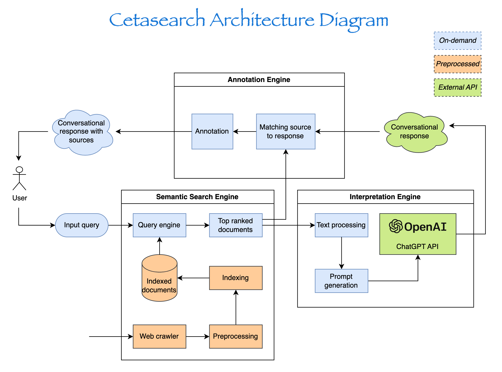
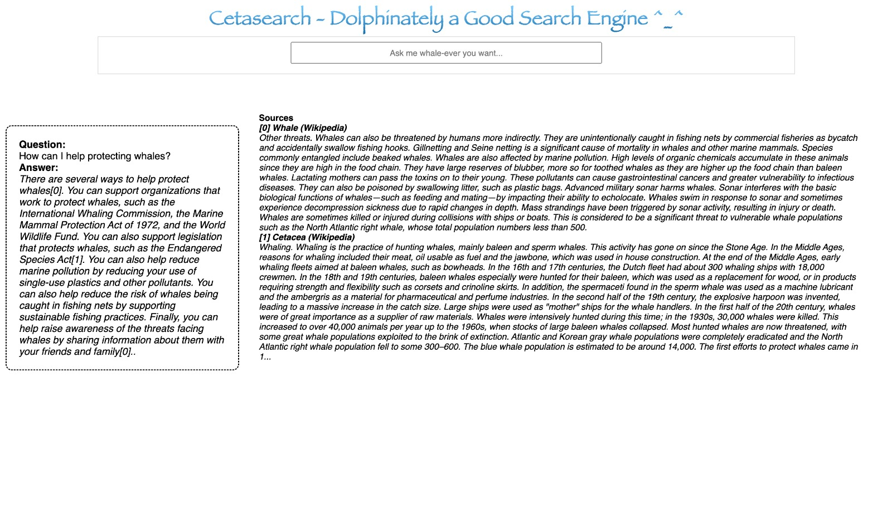
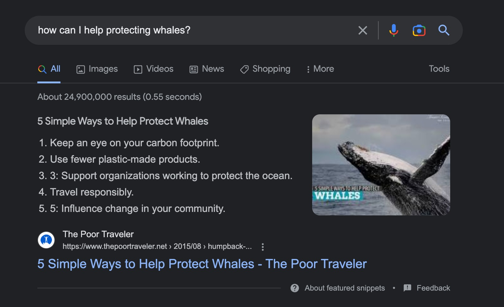
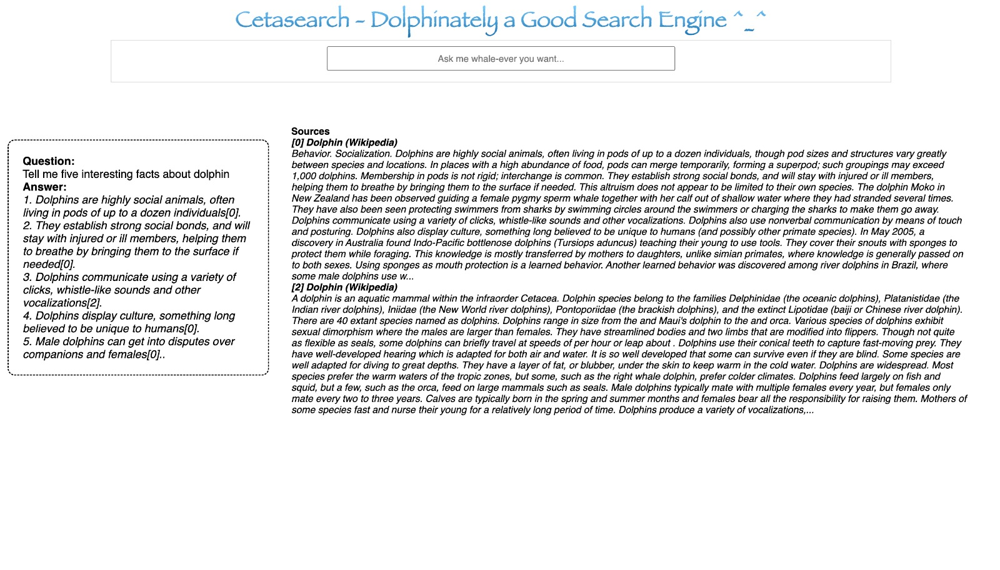
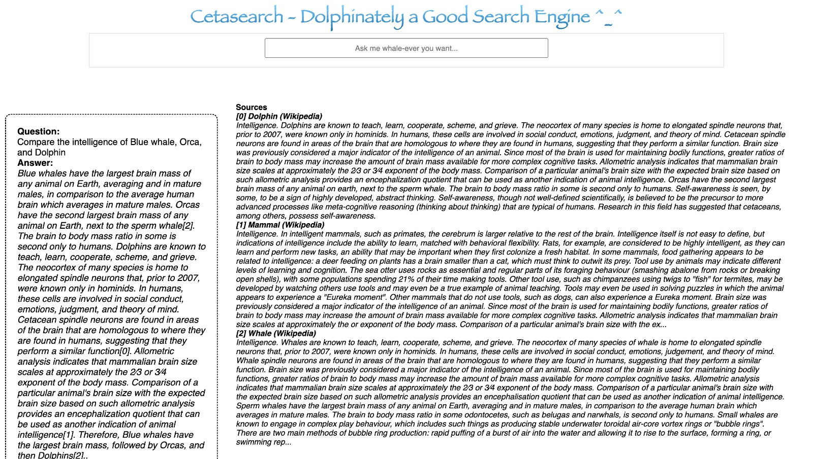

On February 7, 2023, Microsoft launched a new version of Bing that included ChatGPT to enhance search results. Inspired by this advancement and the movie "Avatar: The Way of Water," I created Cetasearch, a search engine that focuses on knowledge about the ocean and cetacean species such as whales, orcas, dolphins, and more. Cetasearch offers conversational answers with detailed links to the sources, which I hope could play a small role in the conservation of the ocean and marine wildlife.

The search engine has three main functionalities: a semantic search engine, generative text completion for conversational answers, and annotations that match answers with sources. Everything was built using publicly available NLP pre-trained models and APIs, such as Sentence transformer, OpenAI's GPT3.5 API, and multiple pre-trained LLMs during development.

> *Data crawling, text processing and indexing is pre-calculated in batch to save inference time*

Due to my limited computational power of my computer, multiple measures were taken to narrow the scope of this project while maintaining the core functionalities:

- Focus on the ocean and cetacean species. The data sources were limited to a small subset of Wikipedia articles centered around these topics.
- Preprocess and index the source documents to save processing time.
- Leverage OpenAI's GPT3.5 API for text completion. During the experimentation phase, I tried a few open-source LLM models as well, but OpenAI's API provided the best answers by a large margin.

Cetasearch provide a better answer to a generic answer than Google's current feature snippet!

Other open-ended questions got good answers as well.

# Features

## Currently available features

The following features are currently available:

- A semantic search engine based on thousands of Wikipedia articles related to the ocean. Due to the tedious and messy nature of data processing, only the end results (processed text and indexes) has been included in the codebase.
- The ability to generate conversational answers using OpenAI's API (`text-davinci-003`). Although GPT3.5 has been found to produce the best results, other text summarization and completion LLMs can be used in its place.
- Annotation of generated answers at the sentence level, linking pieces of the answer to their source materials.

## Future developments

- Fact-checking of generated answers, which is a technically challenging problem that even large companies like Bing and Google are still working on. In the meantime, users will have to fact-check the answers themselves by referring to the annotated sources.
- Annotation at the word/phrase level (possibly using non-maximum suppression, inspired by the computer vision bounding-box drawing task).
- Scaling the search engine beyond limited pre-processed data focusing only on the ocean and whales. A possible next step is to develop a general-purpose search engine.
- Improving response speed by finding ways to reduce the time it takes to rely on OpenAI's API.

## Limitations

As previously noted, Cetasearch currently faces several limitations, including speed, the amount of indexed web documents, and the lack of a fact-checking module. These limitations can impact the accuracy and usefulness of search results, and efforts are underway to address these issues and enhance the functionality of the tool.

# Installation

1. Make sure you include your OpenAI API key as an environment variable under `OPENAI_API_KEY` name. You can sign up for a 3-month free trial [here](https://openai.com/api/pricing/) and access your API key [here](https://help.openai.com/en/articles/4936850-where-do-i-find-my-secret-api-key)
2. Install requirements `pip install -r requirements.txt`
3. Run `python main.py` to initiate the web server
4. Access the search UI using your web browser at `127.0.0.1:5000`

# Credits & Referrences

- [Wiki2txt](https://github.com/david-smejkal/wiki2txt) - for text processing of wikipedia archive
- [Sentence transformer](https://huggingface.co/sentence-transformers/multi-qa-distilbert-cos-v1) - main component of semantic search
- [OpenAI API](https://openai.com/api/) - main component for text generation
- [Avatar - The way of water](https://www.avatar.com/) and the Whale conservation efforts by multiple organizations are the inspiration of this project.
- Tech stack: Python (Numpy, Pandas, Flask,etc.), Transformer-based Large Language Models

*Note: As of Feb 19, 2023, Microsoft's New Bing is still in beta testing and not yet release to the public.*